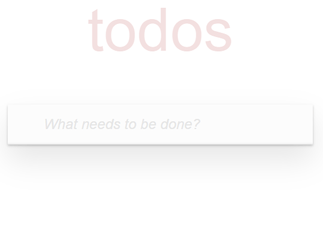

# ✅ ToDo-List App

A sleek, high-performance task management web application built with React and TypeScript. This project goes beyond a simple to-do list, focusing on complex state management, handling edge cases, strict type safety, and delivering a seamless user experience.

## ⚡Live Demo
[ToDo-List Live](https://yahohulia.github.io/todo_list/)

## 🎬 Demo Showcase



## ✨ Features

- **Comprehensive Task Management** - Users can easily add, edit, delete, and toggle the completion status of individual tasks.
- **Smart Filtering & Routing** - Seamlessly filter tasks by "All", "Active", and "Completed" states for better focus and organization.
- **Batch Operations** - Integrated logic to mark all tasks as completed or clear all finished tasks with a single click.
- **Modern Styling Architecture** - Responsive, pixel-perfect layouts crafted with **SCSS** and the **BEM** methodology.
- **Type-Safe Development** - Extensive use of **TypeScript** interfaces for state management and component props to ensure build-time reliability.
- **High Code Quality** - The project strictly follows the **Airbnb TypeScript style guide** with robust ESLint and Stylelint configurations, formatted via Prettier.

## 🛠️ Tech Stack


## ⚙️ Installation & Setup

### Clone the repository:
```bash
  git clone [https://github.com/yahohulia/NiceShop.git](https://github.com/yahohulia/NiceShop.git)
  cd NiceShop
```
### Install dependencies:
```bash
  npm install
    # or
  yarn install
```
### Build the project
```bash
  npm run build
    # or
  yarn run build
```
### Run the project locally:
```bash
  npm start
    # or
  yarn start
```
